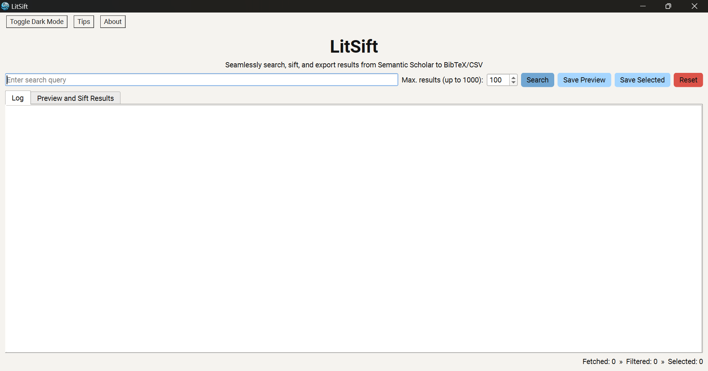
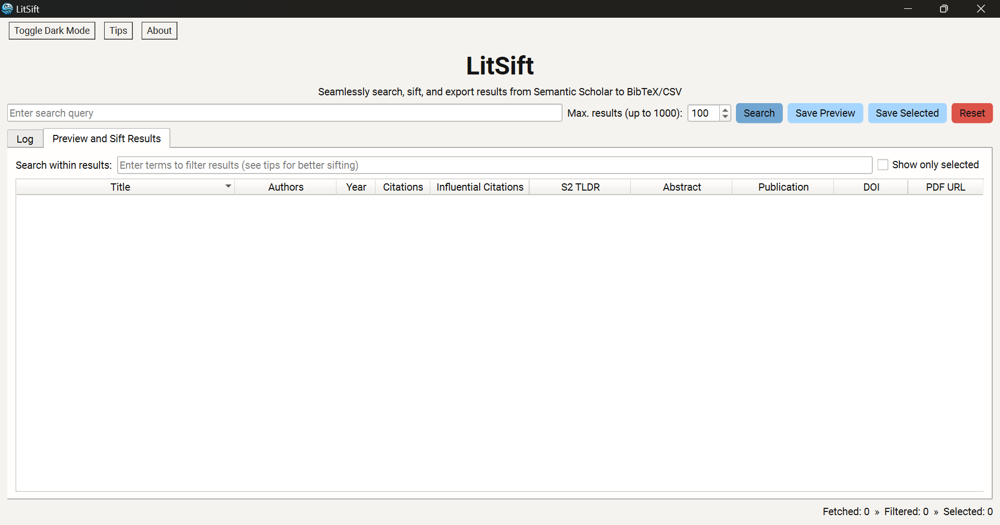

# LitSift 📚🔍

LitSift is an intuitive implementation for searching [Semantic Scholar](https://www.semanticscholar.org) and saving filtered results as BibTeX/CSV. It provides a seamless and easy-to-use Graphical User Interface (GUI) for researchers to fetch results, based on the query, from Semantic Scholar's extensive academic literature database and quickly sift through them using Boolean operators, wildcards, field-specific search, etc., to identify sources relevant to their research.

## Features 🌟

  -  🔎 Search Semantic Scholar's vast database of academic literature.
  -  📋 Retrieve endpoints: `title`, `authors`, `year`, `citationCount`, `influentialCitationCount`, `tldr`, `abstract`, `publicationTypes`, `externalIds`, `openAccessPdf`, `url`, `citationStyles`
  -  👀 Preview and filter results using Boolean logic, wildcard matching, etc.
  -  💾 Save all or selected results to BibTeX/CSV.
  -  😌 Fetch results efficiently without hassles or having to deal with code.
  -  💡 Minimal and intuitive user interface with dark and light mode.
  

## Usage 💻

  1.  Download the latest release from the [Releases](https://github.com/ekjaisal/LitSift/releases) page.
  2.  Set up LitSift on the device using the installer.
  2.  Point and click to launch.
  3.  Enter the query in the search box.
  4.  Set the maximum number of results to fetch (up to 1000).
  5.  Click 'Search' or hit 'Enter' to start the search process.
  6.  View and sift through the fetched results in the 'Preview Results' tab.
  7.  Select results and click 'Save Selected' or 'Save All Results' to export the results to BibTeX/CSV.

## Attribution 🙂

LitSift uses publically accessible endpoints of the [Semantic Scholar Academic Graph API](https://www.semanticscholar.org/product/api) without authentication. All data is fetched directly from [Semantic Scholar](https://www.semanticscholar.org).

## License 📄

This project is licensed under the MIT License. Please see the [LICENSE](LICENSE) file for details.

## Disclaimer 🔴

 This tool is provided as-is, without any warranties. Users are responsible for ensuring that their use of this implementation and the Semantic Scholar API complies with [Semantic Scholar's terms of service](https://www.semanticscholar.org/product/api).

## Acknowledgements 🤝🏾

LitSift has benefitted significantly from some of the many ideas and suggestions of [Sarath Kurmana](https://github.com/sarathkurmana), the assistance of Anthropic's [Claude 3.5 Sonnet](https://www.anthropic.com/news/claude-3-5-sonnet), [Muhammed Rashid's](https://github.com/muhammedrashidx) encouragement, and [Vishnu Rajagopal's](https://vishnurajagopal.in) support.

---

## Suggested Citation ✍🏽

Jaisal, E. K. (2024). LitSift: Seamlessly search, sift, and export results from Semantic Scholar to BibTeX/CSV. Available at: [https://github.com/ekjaisal/litsift](https://github.com/ekjaisal/litsift).
