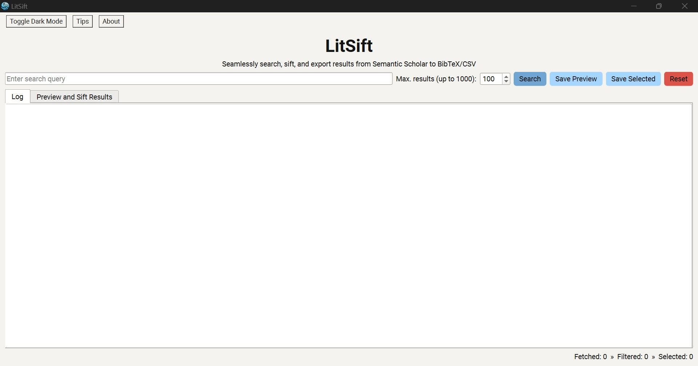
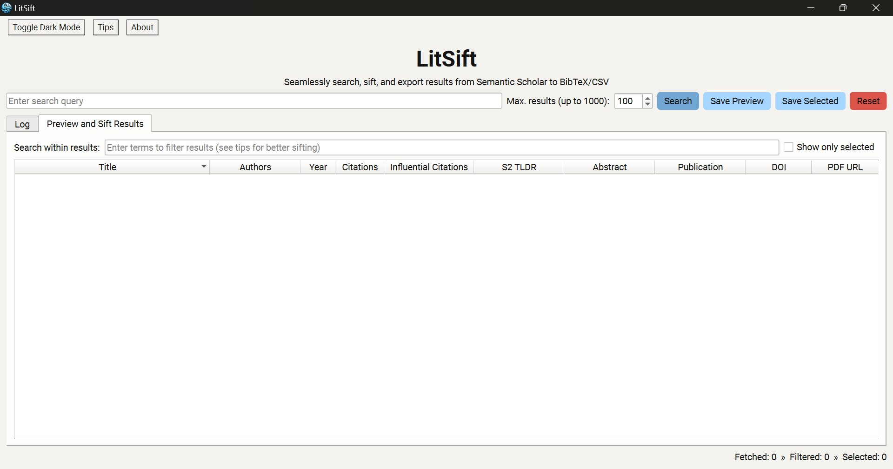
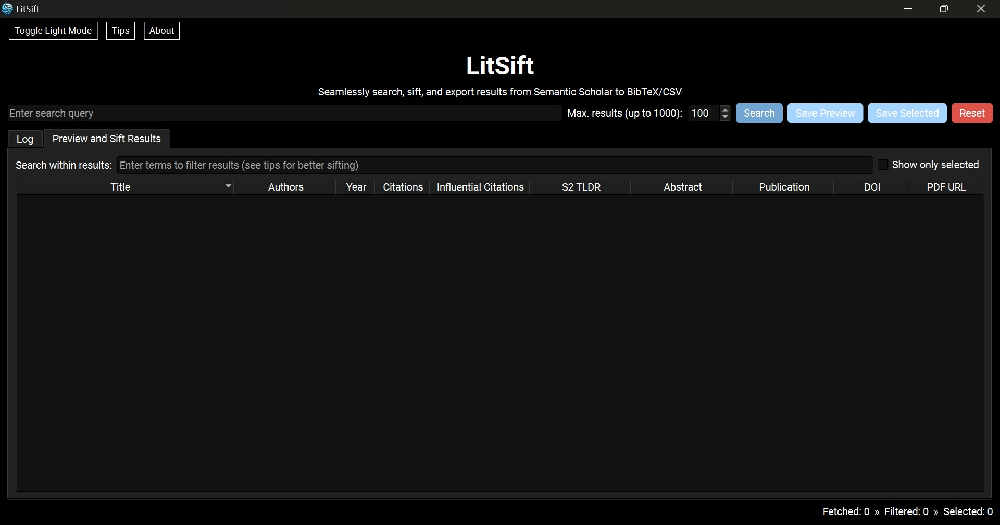

# LitSift

       

LitSift is an intuitive implementation for searching [Semantic Scholar](https://www.semanticscholar.org) and saving filtered results as BibTeX/CSV. It provides a seamless and easy-to-use Graphical User Interface (GUI) for researchers to fetch results, based on the query, from Semantic Scholar's extensive database of academic literature and quickly sift through them using Boolean operators, wildcards, field-specific search, etc., to identify sources relevant to their research.

## Features 🌟

  -  🔎 Search Semantic Scholar's vast database of academic literature and fetch up to 1000 results per query.
  -  📋 Retrieve endpoints: `title`, `authors`, `year`, `citationCount`, `influentialCitationCount`, `tldr`, `abstract`, `venue`, `publicationTypes`, `externalIds`, `openAccessPdf`, `url`, `citationStyles`
  -  ☑️ Preview and filter results using Boolean operators, wildcard matching, phrase matching, `field:term` search, complex query nesting, etc.
  -  👀 View the available details for each result in a convenient and easy-to-read window.
  -  📄 Follow links to open access PDFs when available.
  -  💾 Save all previewed, filtered or selected results to BibTeX/CSV.
  -  😌 Fetch results efficiently without hassles or having to deal with code.
  -  💡 Minimal and intuitive user interface with dark and light modes.

## Usage 💻

1.  Download the latest release from the [Releases](https://github.com/ekjaisal/LitSift/releases) page.
2.  Set up LitSift on the device using the installer.
3.  Point and click to launch.
4.  Enter the query in the search box.
5.  Set the maximum number of results to fetch (up to 1000).
6.  Click 'Search' or hit 'Enter' to initiate the search.
7.  View and filter the fetched results in the 'Preview and Sift Results' tab using simple or complex queries (see tips).
8.  Double-click on the result to view all the available details in a single window.
9.  Double-click on the 'PDF URL' column to follow links to open access PDFs when available.
10.  Select results and click 'Save Selected' or apply filters and click 'Save Preview' to export all the visible results to BibTeX/CSV.
11.  Click 'Reset' to start over and fetch results for a new query.

## Attribution 🙂

LitSift uses publicly accessible endpoints of the [Semantic Scholar Academic Graph API](https://www.semanticscholar.org/product/api) without authentication. All data is fetched directly from [Semantic Scholar](https://www.semanticscholar.org).

## License 📄

This project is licensed under the MIT License. Please see the [LICENSE](LICENSE) file for details.

## Disclaimer 📣

This tool is provided as-is, without any warranties. Users are responsible for ensuring that their use of this implementation and the Semantic Scholar API complies with [Semantic Scholar's terms of service](https://www.semanticscholar.org/product/api).

## Acknowledgements 🤝🏾

LitSift has benefitted significantly from some of the many ideas and suggestions of [Sarath Kurmana](https://github.com/sarathkurmana), the assistance of Anthropic's [Claude 3.5 Sonnet](https://www.anthropic.com/news/claude-3-5-sonnet) with all the heavy lifting, feedback from [Dhananjayan T. Ashok](https://in.linkedin.com/in/dhananjayan-ashok-geology) and [Jayakrishnan S. S.](https://www.linkedin.com/in/jayakrishnan-s-s-342416181), [Muhammed Rashid's](https://github.com/muhammedrashidx) encouragement, and [Vishnu Rajagopal's](https://vishnurajagopal.in) support.

